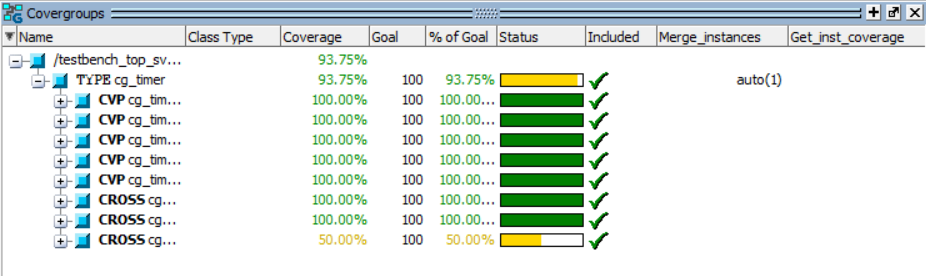

## Project Overview
This project validates a 32-bit Timer Slave Peripheral designed for SoC integration. The DUT communicates via a custom **REQ/GNT handshake protocol** and supports programmable countdowns, auto-reload modes, and interrupt generation.

The verification environment was architected from scratch using a layered class-based approach (Driver, Monitor, Scoreboard) to ensure modularity and reusability.

## Verification Features
*   **Methodology:** Constrained Random Verification (CRV) & Coverage Driven Verification (CDV).
*   **Architecture:** Generator $\rightarrow$ Driver $\rightarrow$ Virtual Interface $\rightarrow$ Monitor $\rightarrow$ Scoreboard.
*   **Checking:** Self-checking Scoreboard with a Golden Reference Model and Protocol Assertions.

## Test Scenarios & Edge Cases
Defined in `testbench_top.sv`, the verification plan specifically targeted the following scenarios:

### 1. Directed & Corner Case Tests
*   **Load Zero Handling:** Verified the specific edge case where writing `0` to the `LOAD` register must be internally coerced to `1` (preventing infinite loops).
*   **Saturation/Max Load:** Validated timer behavior with the maximum 16-bit value (`0xFFFF`) to check for overflow or timing glitches.
*   **Sticky Bit Clearance:** Verified that the `EXPIRED` interrupt flag remains set until explicitly cleared via "Write-1-to-Clear" or "Read-to-Clear" mechanisms.

### 2. Operational Mode Tests
*   **Auto-Reload Verification:** Validated that the timer automatically re-arms itself without software intervention when `RELOAD_EN` is set.
*   **Stress Testing:** Randomized traffic injection with variable delays to stress the bus handshake protocol.

### 3. Protocol Compliance (SVA)
Implemented in `timer_sva.sv` to validate signal timing:
*   `R1_GNT_ASSERT_3_CYCLES`: Ensures Slave asserts `GNT` within $\le 3$ cycles of `REQ`.
*   `R2_REQ_WAIT_2_GNT`: Checks that Master holds `REQ` stable until `GNT` is received.

## Functional Coverage

Coverage model (`coverage_collector_timer.sv`) ensures 100% verification of:
*   **Register Access:** All registers (CONTROL, LOAD, STATUS) read/written.
*   **Data Bins:** Corner values (0, 1), Low range, and High range.
*   **Cross Coverage:**
    *   `cross_load_zero`: Interaction between Address `LOAD` and Data `0`.
    *   `cross_modes`: Interaction between `Start` bit and `Reload_En` bit.

## Bugs Detected
The environment successfully identified RTL logic errors injected into the design:
1.  **Protocol Violation:** For specific addresses (aligned to 8), the DUT asserted `GNT` after 4 cycles (Spec violation: limit is 3).
2.  **Logic Error:** The `RELOAD_EN` configuration bit was incorrectly mapped to the `CLR_STATUS` bit in the control logic.
3.  **Edge Case Failure:** Loading `0` was not coerced to `1`, causing the timer to stall or behave unpredictably.
